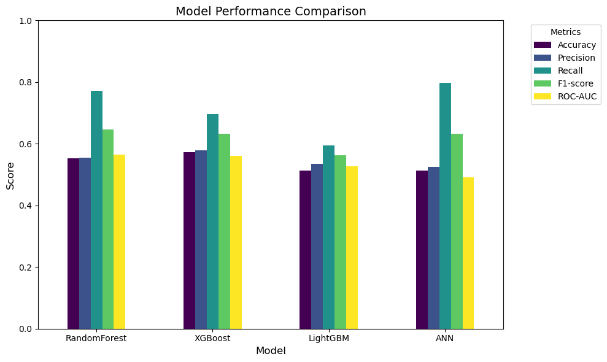
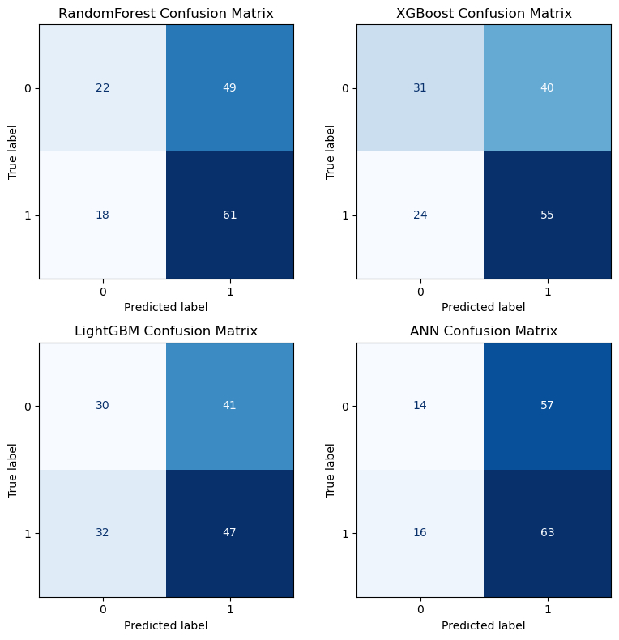
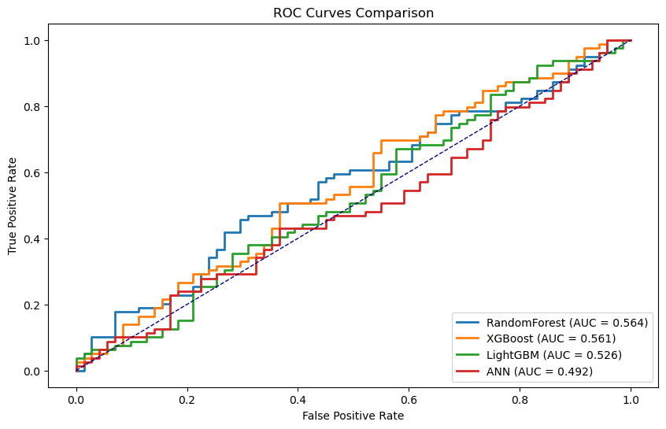

# 🎯 Customer Retention Prediction 

## Overview
This project implements machine learning models to predict **customer churn** using a tabular dataset.  
It covers the complete pipeline from **Exploratory Data Analysis (EDA)** to **model training, evaluation, and insights**.  
The goal is to identify which model best predicts churn and provides actionable insights for business decisions.

---

## 📊 Dataset
- **Source:** Given by SM Technology for a Task Submission
- **Size:** 1000 x 15
- **Features:**  
  - `Gender` – Customer gender  
  - `Email_Opt_In` – Email subscription status  
  - `Promotion_Response` – Response to promotions  
  - … *(other features as applicable)*  
- **Target:** `Target_Churn` – Whether the customer churned (1 = Yes, 0 = No)

---

## 📁 Project Structure 
```
Customer_Retention_Prediction/
│
├── data/
│   └── dataset.csv                           # Original dataset
|
├── notebook/
│   └── Customer_Retension_prediction.ipynb   # EDA, preprocessing, training, evaluation
|
├── images/                                   # Evaluation visualizations
│   └── ROC_curve.jpeg
│   ├── confusion_matrix.jpeg
│   └── performance_bar_chart.jpeg
|
├── saved_models/
│   └── rf_model.pkl                          # Trained ML models (RF, XGB, LGBM, ANN)
│   ├── xgb_model.pkl
│   ├── lgbm_model.pkl
│   └── ann_model.pkl
|
├── README.md                                 # Project Documentation
└── requirements.txt                          # Python dependencies

```

## ⚙️ Setup Instructions 
1. Clone the repository:
```bash
git clone https://github.com/niloysannyal/Customer_Retension_Prediction.git
```
2. Navigate to the project folder:
```
cd Customer_Retension_Prediction
```
3. Install dependencies:
```
pip install -r requirements.txt
```
4. Open the Jupyter Notebook:
```
notebook/Customer_Retension_Prediction.ipynb
```

##  Methodology 

### 🔍 Exploratory Data Analysis (EDA)
- Analyze data distribution and identify missing values
- Correlation analysis between features and target
- Visualization of features vs target to detect patterns and relationships

### 🛠️ Feature Engineering
- Creation of new meaningful features based on domain knowledge
- Transformation of existing features to improve model performance
- Handling categorical variables effectively (e.g., encoding, one-hot)

### ⚙️ Data Preprocessing
- Handling missing values and outliers
- Categorical encoding
- Feature scaling (standardization/normalization)
- Train-test split for model evaluation

### 🧠 Model Training
- Models used: Random Forest, XGBoost, LightGBM, and ANN (Keras)
- Hyperparameter tuning for tree-based models
- Early stopping, batch normalization, and dropout for ANN to prevent overfitting

### ⚖️ Evaluation
- Performance metrics: Accuracy, Precision, Recall, F1-score, ROC-AUC
- Confusion matrix and ROC curve analysis
- Feature importance analysis for tree-based models


---

## 📈 Results 

| Model        | Accuracy | Precision | Recall | F1-score | ROC-AUC |
|--------------|----------|-----------|--------|----------|---------|
| RandomForest | 0.553    | 0.555     | 0.772  | 0.646    | 0.564   |
| XGBoost      | 0.573    | 0.579     | 0.696  | 0.632    | 0.561   |
| LightGBM     | 0.513    | 0.534     | 0.595  | 0.563    | 0.526   |
| ANN          | 0.513    | 0.525     | 0.797  | 0.633    | 0.492   |

**Best Model:** RandomForest  
- Balances accuracy and recall, providing a robust prediction for churn  
- Tree-based models outperform ANN due to **small dataset size**  
- ANN shows high recall but low ROC-AUC, indicating overfitting to the minority class  

**Key Insights:**  
- Customer churn dataset is imbalanced → affects ANN performance  
- Feature engineering and categorical encoding improve tree-based model results  
- Early stopping and batch normalization help ANN training but cannot surpass tree models on small data  

---

## 📊 Evaluation Visualizations 

### Metric Comparison


### Confusion Matrix


### ROC Curve



---

## 📜 License 
This project is licensed under the **MIT License**.

---

## Author 👨‍💻
- **Name:** **Niloy Sannyal**  
- **Email:** niloysannyal@gmail.com  
- **GitHub:** [https://github.com/niloysannyal](https://github.com/niloysannyal)  


